# [tt_metal](https://github.com/tenstorrent/tt-metal) setup on [Wormhole n300](https://tenstorrent.com/hardware/cards)

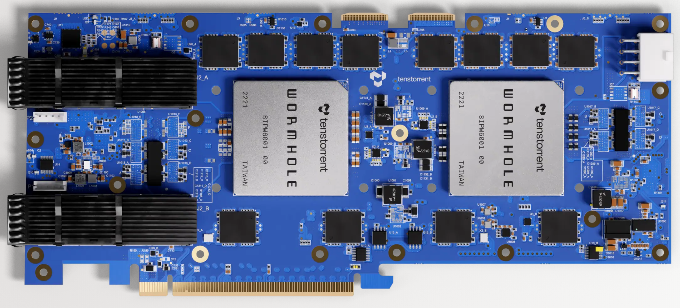

## Step 1

```bash
tt-smi
```

### Expected output

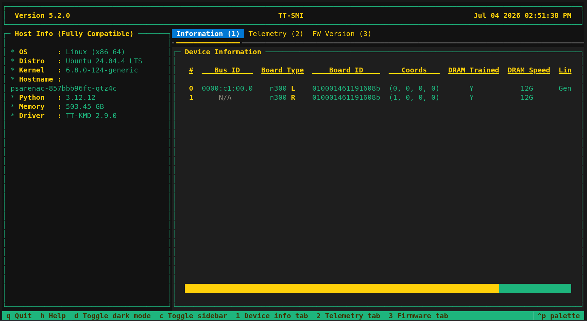

## Step 2

```bash
sudo apt install -y git clang clang-20 cmake ninja-build pip python3.12-venv libopenmpi-dev openmpi-bin pciutils
```

## Step 3

```bash
clang --version
```

### Expected output (14 <= version <= 18 for [tt-mlir](https://github.com/tenstorrent/tt-mlir))


## Step 4

```bash
clang-20 --version
```

### Expected output (version >= 20 for [tt-mlir](https://github.com/tenstorrent/tt-mlir) with `-DTTMLIR_ENABLE_RUNTIME=ON`)

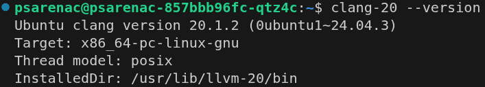

## Step 5

```bash
cmake --version
```

### Expected output (version >= 3.24 for [tt-mlir](https://github.com/tenstorrent/tt-mlir))

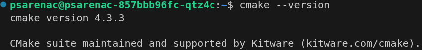

## Step 6

```bash
ninja --version
```

### Expected output (version >= 1.11.1 for [tt-mlir](https://github.com/tenstorrent/tt-mlir))


## Step 7

```bash
python3.12 --version
```

### Expected output (version == 3.12.x for [tt-mlir](https://github.com/tenstorrent/tt-mlir))

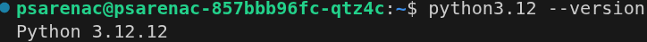

## Step 8

```bash
pkg-config --modversion mpi-c
```

### Expected output (version not important)

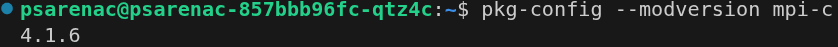

## Step 9

```bash
lspci | grep -i tenstorrent
```

### Expected output

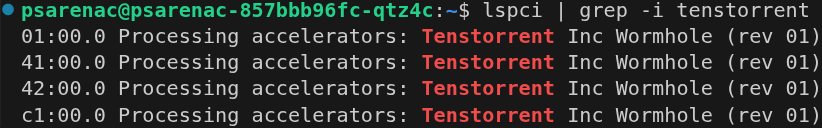

## Step 10

```bash
ls -la /dev/tenstorrent/
```

### Expected output

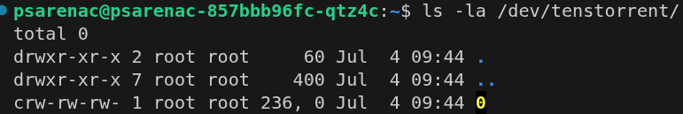

## Step 11

```bash
git clone https://github.com/tenstorrent/tt-metal.git --recurse-submodules
```

## Step 12

```bash
cd tt-metal
```

## Step 13

```bash
git submodule status
```

### Expected output

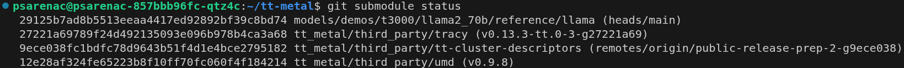

## Step 14

```bash
./build_metal.sh
```

## Step 15

```bash
echo $?
```

### Expected output

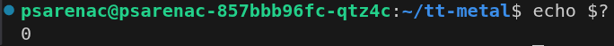

## Step 16

```bash
ls build/
```

### Expected output

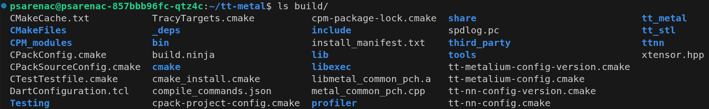

## Step 17

```bash
export PYTHON_ENV_DIR=$HOME/tt-metal/python_env
```

## Step 18

```bash
./create_venv.sh
```

## Step 19

```bash
source python_env/bin/activate
```

## Step 20

```bash
export PYTHONPATH=$HOME/tt-metal
```

## Step 21

```bash
python3 -m ttnn.examples.usage.run_op_on_device
```

### Expected output

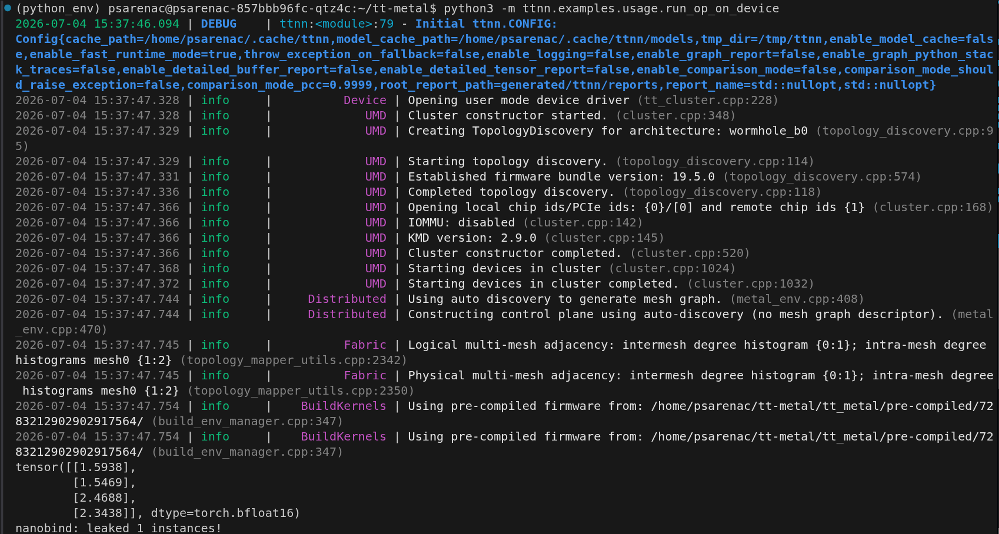