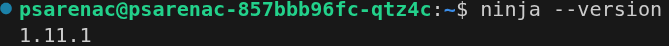
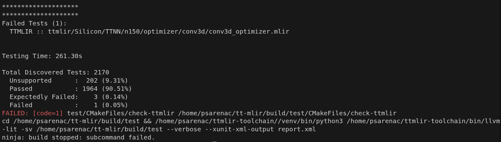

# [tt_mlir](https://github.com/tenstorrent/tt-mlir) setup on [Wormhole n300](https://tenstorrent.com/hardware/cards)


## Next step

```bash
sudo apt install -y git clang clang-20 cmake ninja-build pip python3.12-venv
```

## Next step

```bash
clang --version
```

### Expected output (14 <= version <= 18 for [tt-mlir](https://github.com/tenstorrent/tt-mlir))


## Next step

```bash
clang-20 --version
```

### Expected output (version >= 20 for [tt-mlir](https://github.com/tenstorrent/tt-mlir) with `-DTTMLIR_ENABLE_RUNTIME=ON`)


## Next step

```bash
cmake --version
```

### Expected output (version >= 3.24 for [tt-mlir](https://github.com/tenstorrent/tt-mlir))


## Next step

```bash
ninja --version
```

### Expected output (version >= 1.11.1 for [tt-mlir](https://github.com/tenstorrent/tt-mlir))



## Next step

```bash
python3.12 --version
```

### Expected output (version == 3.12.x for [tt-mlir](https://github.com/tenstorrent/tt-mlir))


## Next step

```bash
deactivate 2>/dev/null
```

## Next step

```bash
unset VIRTUAL_ENV PYTHON_ENV_DIR PYTHONPATH
```

## Next step

```bash
hash -r
```

## Next step

```bash
echo $VIRTUAL_ENV $PYTHON_ENV_DIR $PYTHONPATH
```

### Expected output: (empty)

## Next step

```bash
git clone https://github.com/tenstorrent/tt-mlir.git
```

## Next step

```bash
cd tt-mlir
```
## Next step

```bash
export TTMLIR_TOOLCHAIN_DIR=$HOME/ttmlir-toolchain/
```

## Next step

```bash
mkdir -p "${TTMLIR_TOOLCHAIN_DIR}"
```

## Next step

```bash
cmake -B env/build env -DCMAKE_C_COMPILER=clang -DCMAKE_CXX_COMPILER=clang++
```

## Next step

```bash
cmake --build env/build
```

## Next step

```bash
rm -rf $HOME/tt-mlir/env/build
```

## Next step

```bash
source env/activate
```

## Next step

```bash
cmake -G Ninja -B build \
    -DCMAKE_C_COMPILER=clang \
    -DCMAKE_CXX_COMPILER=clang++ \
    -DTTMLIR_ENABLE_RUNTIME=ON \
    -DTTMLIR_ENABLE_OPMODEL=ON \
    -DTTMLIR_ENABLE_STABLEHLO=ON \
    -DTTMLIR_ENABLE_PYKERNEL=ON \
    -DTTMLIR_ENABLE_D2M_JIT=ON \
    -DTTMLIR_ENABLE_TTNN_JIT=ON \
    -DTTMLIR_ENABLE_RUNTIME_TESTS=ON \
    -DTTMLIR_ENABLE_OPMODEL_TESTS=ON \
    -DTT_RUNTIME_ENABLE_PERF_TRACE=ON \
    -DTT_RUNTIME_DEBUG=ON \
    -DCMAKE_CXX_COMPILER_LAUNCHER=ccache
```

## Next step

```bash
cmake --build build
```

## Next step

```bash
ttrt query --save-artifacts
```

## Next step

```bash
export SYSTEM_DESC_PATH=$HOME/tt-mlir/ttrt-artifacts/system_desc.ttsys
```

## Next step

```bash
cmake --build build -- check-ttmlir
```

### Expected output



## Next step

```bash
pre-commit install
```

## Next step

```bash
cmake --build build -- clang-tidy
```

## Next step

```bash
cmake --build build -- clang-tidy-ci
```

## Optional Documentation Generation  

## Next step

```bash
cd $HOME
```

## Next step

```bash
curl -L https://github.com/rust-lang/mdBook/releases/download/v0.5.3/mdbook-v0.5.3-x86_64-unknown-linux-gnu.tar.gz -o mdbook.tar.gz
```

## Next step

```bash
tar xzf mdbook.tar.gz
```

## Next step

```bash
mkdir -p $HOME/bin
```

## Next step

```bash
mv $HOME/mdbook $HOME/bin/mdbook
```

## Next step

```bash
export PATH="$HOME/bin:$PATH"
```

## Next step

```bash
cd tt-mlir
```

## Next step

```bash
source env/activate
```

## Next step

```bash
cmake --build build -- docs
```

## Next step

```bash
mdbook serve build/docs
```
