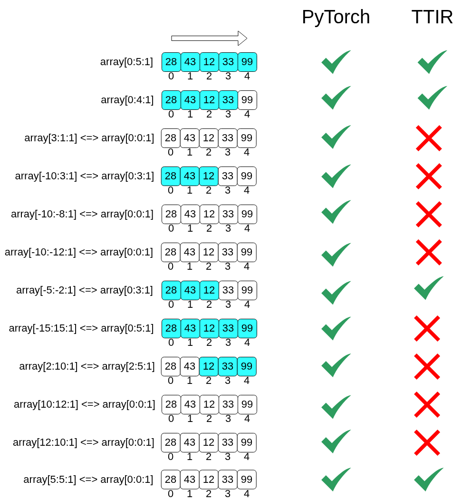
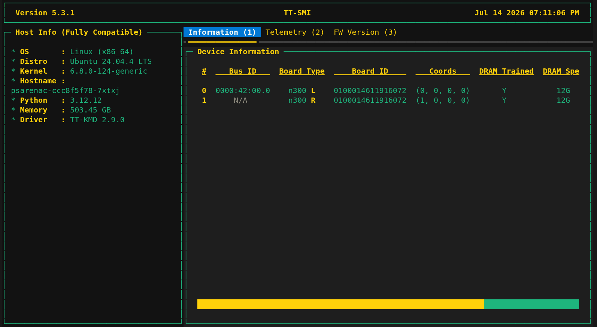
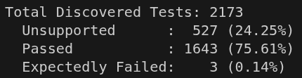
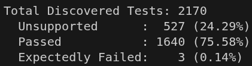
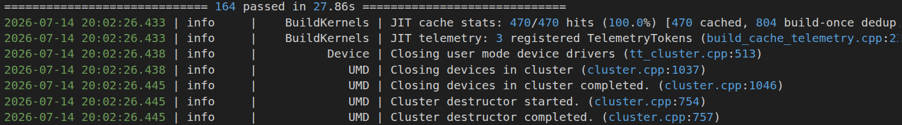
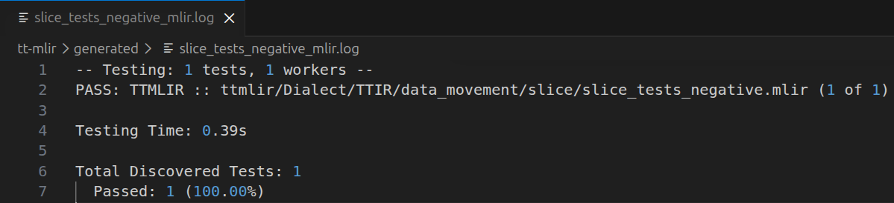
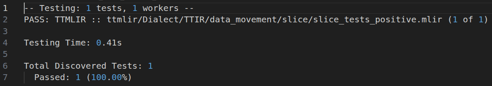
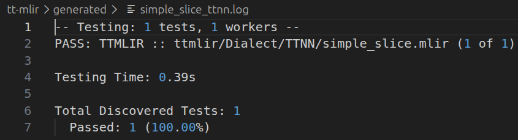

# [Issue 6275](https://github.com/tenstorrent/tt-mlir/issues/6275) : Fix slice verification

## Problem description

Before [this pull request](https://github.com/tenstorrent/tt-mlir/pull/9026), TTIR was not fully compatible with PyTorch slicing semantics. PyTorch slicing never raises errors for out-of-bounds slice indices, so TTIR should behave the same way.

Since [this pull request](https://github.com/tenstorrent/tt-mlir/pull/9026) relaxes verification for the TTIR static slice operation, an appropriate conversion pattern is required before lowering to the TTNN dialect to ensure slice bounds are handled correctly and to prevent out-of-bounds errors.

Below is the analysis of the compatibility between PyTorch and TTIR slicing before [this pull request](https://github.com/tenstorrent/tt-mlir/pull/9026):



## What's changed

TBD

## Proofs of testing

After executing the following command:

```bash
tt-smi
```

This was the output that shows information about the Tenstorrent hardware that I have used:



I have built `tt-mlir` with the following commands:

```bash
cmake -G Ninja -B build \
    -DCMAKE_C_COMPILER=clang \
    -DCMAKE_CXX_COMPILER=clang++ \
    -DTTMLIR_ENABLE_RUNTIME=ON \
    -DTTMLIR_ENABLE_OPMODEL=ON \
    -DTTMLIR_ENABLE_STABLEHLO=ON \
    -DTTMLIR_ENABLE_PYKERNEL=ON \
    -DTTMLIR_ENABLE_D2M_JIT=ON \
    -DTTMLIR_ENABLE_TTNN_JIT=ON \
    -DTTMLIR_ENABLE_RUNTIME_TESTS=ON \
    -DTTMLIR_ENABLE_OPMODEL_TESTS=ON \
    -DTT_RUNTIME_ENABLE_PERF_TRACE=ON \
    -DTT_RUNTIME_DEBUG=ON \
    -DCMAKE_CXX_COMPILER_LAUNCHER=ccache
```

```bash
cmake --build build
```

I have executed the following command before my changes:

```bash
cmake --build build -- check-ttmlir
```

This was the output:



I have executed the same command again after my changes:

```bash
cmake --build build -- check-ttmlir
```

This was the output:



This confirms that my changes haven't caused any regressions.
Number of tests differs because I have removed some existing tests and added new ones.

I have executed the following command to run `tt-mlir/test/python/golden/ttir_ops/data_movement/test_data_movement.py::test_slice` tests after my changes (after removing tests that have become unnecessary and incorrent after my changes):

```bash
cd tt-mlir
```

```bash
source env/activate
```

```bash
pytest test/python/golden/ttir_ops/data_movement/test_data_movement.py::test_slice -v 2>&1 | tee generated/test_slice.log
```

This was the output:



I have executed the following command to run `test/ttmlir/Dialect/TTIR/data_movement/slice/slice_tests_negative.mlir` tests after my changes (after removing tests that have become unnecessary and incorrent after my changes):

```bash
cd tt-mlir
```

```bash
source env/activate
```

```bash
llvm-lit test/ttmlir/Dialect/TTIR/data_movement/slice/slice_tests_negative.mlir -v 2>&1 | tee generated/slice_tests_negative_mlir.log
```

This was the output:



I have executed the following command to run `test/ttmlir/Dialect/TTIR/data_movement/slice/slice_tests_positive.mlir` tests after my changes (and after adding new tests to cover new behavior):

```bash
cd tt-mlir
```

```bash
source env/activate
```

```bash
llvm-lit test/ttmlir/Dialect/TTIR/data_movement/slice/slice_tests_positive.mlir -v 2>&1 | tee generated/slice_tests_positive_mlir.log
```

This was the output:



I have executed the following command to run `tt-mlir/test/ttmlir/Dialect/TTNN/simple_slice.mlir` tests after my changes:

```bash
cd tt-mlir
```

```bash
source env/activate
```

```bash
llvm-lit test/ttmlir/Dialect/TTNN/simple_slice.mlir -v 2>&1 | tee generated/simple_slice_ttnn.log
```

This was the output:


